# LidarPrior4GaussianSplatting
Using prior LiDAR point cloud information to enhance the accuracy and robustness of Gaussian Splatting
## Setup

Our default, provided install method is based on Conda package and environment management:
```shell
conda env create --file environment.yml
conda activate gaussian_splatting
```
I suggest using CUDA 11.8 and manually installing these two items:
```shell
pip install submodules/diff-gaussian-rasterization
pip install submodules/simple-knn
```
## The experimental results
### Underground Parking Lot A
From left to right: Ground truth of the ground, model rendered image, LiDAR point cloud to image projection.
| 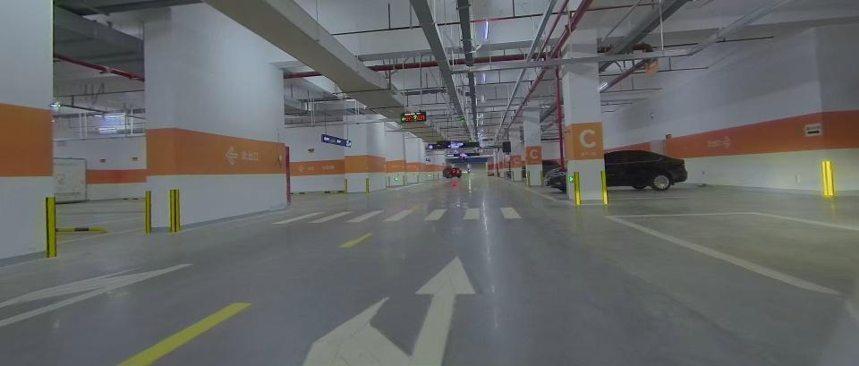 | .JPEG) | .JPEG) |
| --- | --- | --- |
| .JPEG) | .JPEG) | .JPEG) |
|  |  |  |
| .JPEG) | .JPEG) | .JPEG) |
|  |  |  |
| .JPEG) | .JPEG) | .JPEG) |
|  |  |  |
| .JPEG) | .JPEG) | .JPEG) |
|  |  |  |
| .JPEG) | .JPEG) | .JPEG) |
|  |  |  |
### Underground Parking Lot B
| 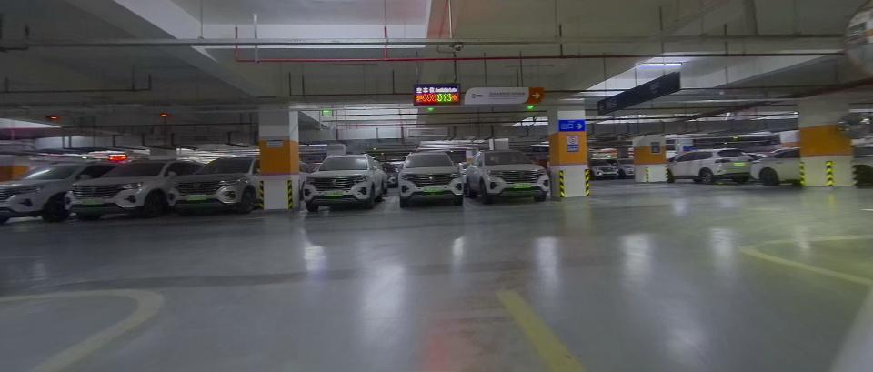 | 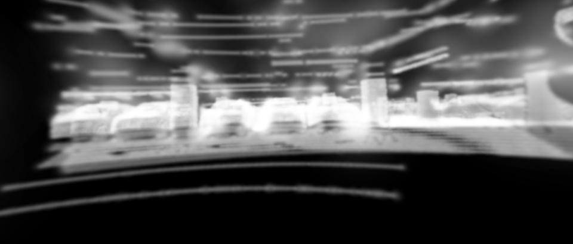 | 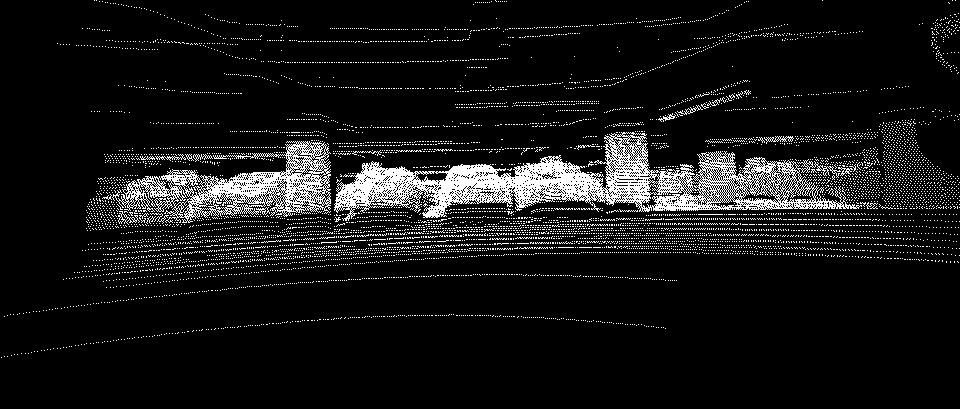 |
| --- | --- | --- |
| 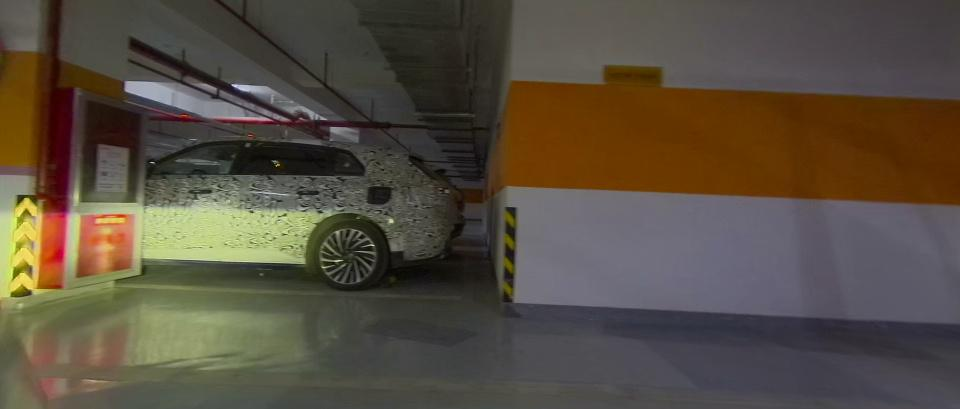 | 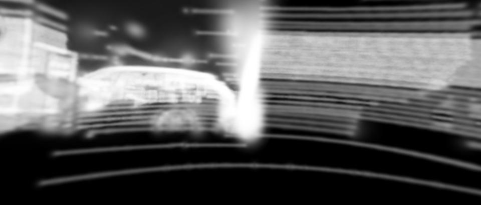 | 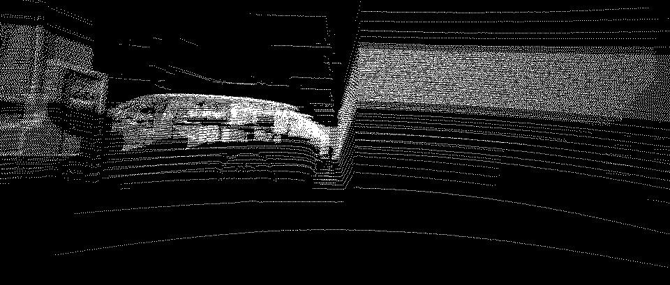 |
|  |  |  |
| 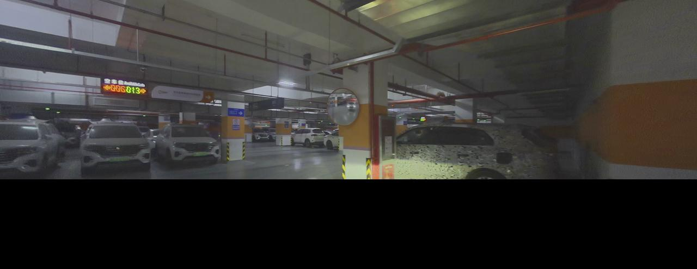 |  | 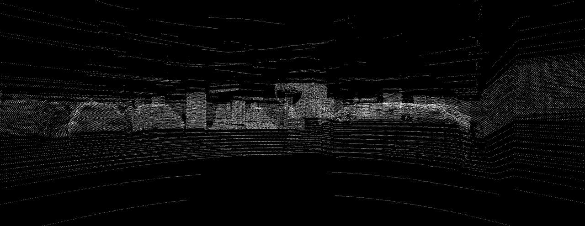 |
|  |  |  |
| 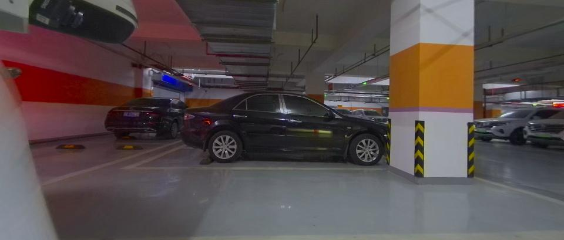 | 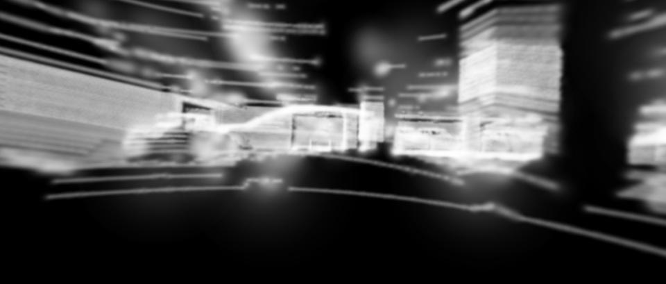 | 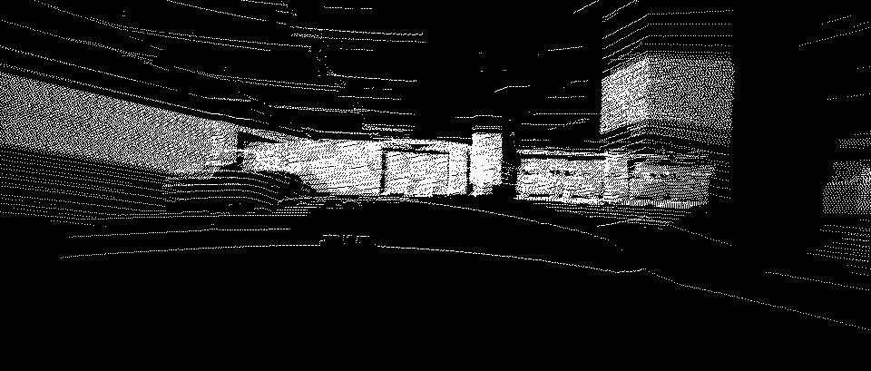 |
|  |  |  |
| 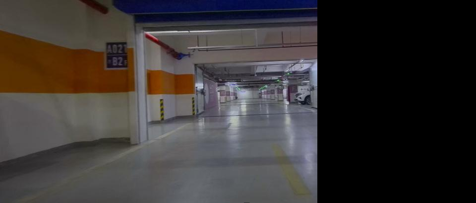 | 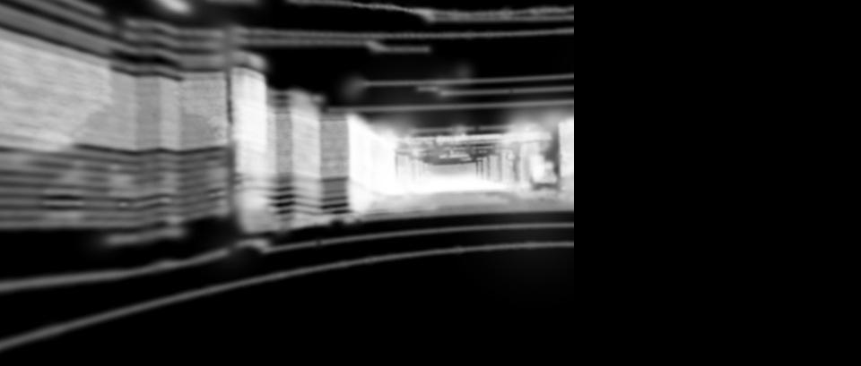 | 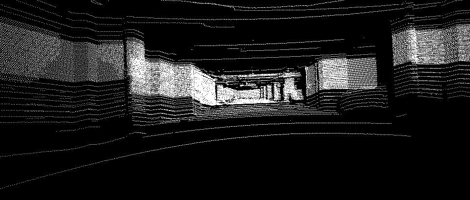 |
|  |  |  |
| 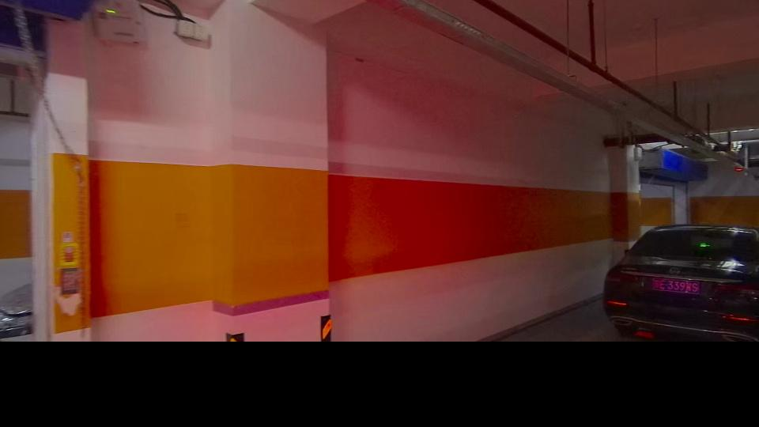 |  | 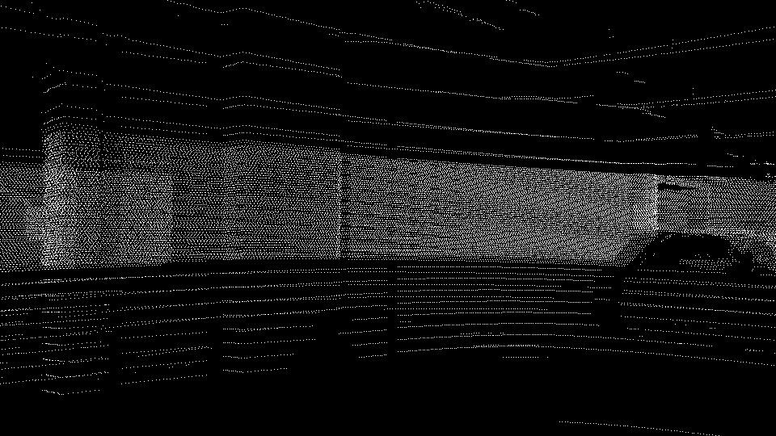 |
|  |  |  |
